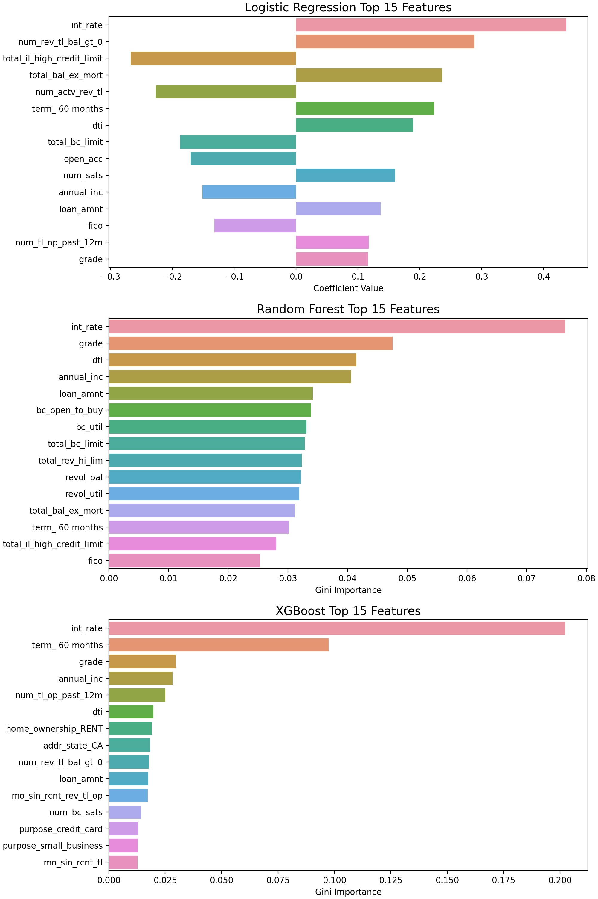

# LendingClub Loan Classification 

## Table of Contents

1. [Background](#background)
2. [Project Overview](#overview)
3. [Target and Predictors](#target)
4. [Data Processing](#processing)
5. [Exploratory Plots](#eda)
6. [Class Imbalance and Scoring](#class)
7. [Model Tuning and Results](#results)
8. [Feature Importance](#feature)
9. [Running the Code](#guide)
10. [Conclusions and Future Work](#future)

## Background 

[LendingClub](https://www.lendingclub.com/) is a fin-tech company started in 2006, whose focus is allowing consumers to access financial products using the internet. For most of its history, LendingClub's main product was facilitating unsecured peer-to-peer loans ranging from $1000 to $40,000. At its 2015 peak, LendingClub was the largest peer-to-peer loan platform in the world. At that point, $15.98 billion in loans had been originated through its history. In the fall of 2020, LendingClub ended its peer-to-peer lending program for undisclosed reasons to focus on commercial banking.

As of 2015, according to [Wikipedia](https://en.wikipedia.org/wiki/LendingClub#Loan_performance_statistics), the average LendingClub borrower had the following characteristics:

* FICO score of 699
* Debt-to-income ratio of 17.7%
* Credit history of 16.2 years
* Annual personal income of $73,945
* Sought out a loan of $14,553 for debt consolidation or paying off credit cards

On the investor side, LendingClub peer investors:

* Funded $11 billion in total loans, including $2 billion in Q2 2015
* Funded loans with an average nominal interest rate of 14% and default rate of 3.39% 
* Earned average net annualized returns of 8.93%.

## Project Overview 
### The Classification Task
While LendingClub boasted a default rate of 3.39%, a much higher percentage of its loans were categorized as "charged off." This means that the loan was unlikely to be fully paid, and therefore it had been sold to a third-party collections agency. As a potential investor seeking to maximize returns, it would be usueful to predict ahead of time whether a loan would be charged off or not. In this project, we trained classification models using Logistic Regression, Random Forest, and XGBoost to predict charge-off status. 

### Dataset Description

The dataset we used contains over 2 million loans, with over 150 variables, spanning 2012 through 2018. A link to the dataset can be downloaded [here](https://www.kaggle.com/wordsforthewise/lending-club), and the official data dictionary for it can be downloaded [here](https://resources.lendingclub.com/LCDataDictionary.xlsx).

LendingClub periodically released its loan information on their website, but has since discontinued the practice. We used the most comprehensive LendingClub dataset we could find, which was scraped from the LendingClub website, agglomerated, and made available on [Kaggle](https://www.kaggle.com/wordsforthewise/lending-club). The dataset was described as loans from 2007 to 2018, but we only found loans from 2012 to 2018. Although LendingClub no longer provides support for its dataset online, we found a [data dictionary](https://resources.lendingclub.com/LCDataDictionary.xlsx) on their website that describes each of the variables.

### Purpose
The full dataset was only available for accepted loans, so we could only build models on loans that were accepted by LendingClub. We should clarify that this is a very different task than if we could build models on all loan applications. For the latter, it would be much easier to distinguish between good and bad loans, and such a classifier would be used as a primary filter, for example by LendingClub itself. What we have instead, is to build models classifying on the "good" loans that LendingClub deemed worthy of acceptance. This is a much harder task, so we expect performance to be much worse. A potential use would be, for example, as a secondary filter deployed by one of LendingClub's peer investors seeking any additional edge (over picking at random) to maximize their returns. 

## Target and Predictors 
### Selecting only loans from 2012 and 2013
Our target variable, `loan_status`, had three main values: `{Charged Off, Fully Paid, Current}`. We merged the much smaller proportions of late or defaulted loans with the Charged-Off category. Since we want to predict if a loan will be Charged Off or Fully Paid upon completion, we can't include loans whose status is Current. We couldn't select all the non-Current loans either, as that biases towards loans that get ended early. 

LendingClub loans had a term of 3 or 5 years, so we probably need to filter out all loans issued within 5 years of when the dataset was collected (2018). We created the following figure characterizing completed (or non-Current) loans by issuance year:

In the chart on the left, we see that completed loans issued from 2012 through 2015 increased dramatically, corresponding to LendingClub's general rise in popularity. 

On the right, we see that the percentage of completed loans which are Fully Paid remains stable for 2012 and 2013, for which all loans have naturally matured, but then steadily declines. This confirms our suspicion that prematurely ended loans (those from 2014 and onwards) are biased in a certain direction. 

Therefore, we had to filter out the vast majority of our dataset, and select only loans from 2012 and 2013.

### Dropping predictors to prevent data leakage

Many of the features we had available in our dataset were collected after loan issuance. Some of them were directly related to loan payments, or absence thereof. Others were redundant with having a charged-off loan, such as drops in credit score or decreases in borrowing limits. There was a lot of potential for data leakage, so we went through the data dictionary and dropped all predictors which were possibly collected after loan issuance.

The remaining preddictors, we are confident would be availble to us in a real-world setting. Useful ones include FICO score, grade (given by LendingClub), interest rate (assigned by LendingClub), annual income, employee length, state, debt-to-income ratio, and others. We briefly considered whether grade and interest rate, since they are reflective of charge-off probability, might be considered data leakage, but as we stated above the purpose is to build a classifier on top of information provided by LendingClub, which could be used by an individual investor.

## Data Processing 

We processed the data as follows:

1. **Dask and memory management** - The full data set was too large to fit into memory, so we used dask to parallelize the loading and dropping of rows and columns. Then we employed memory management with dtypes to optimize speed for the resulting Pandas dataframe.
2. **Categorical and ordinal data** - We found that all of the ordinal variables could naturally be converted to numeric. For example, A-G grades could be turned into 0-7. Then we introduced dummys for each of the categorical variables. State was the largest one, needing 49 dummy variables.
3. **Dealing with missing values** - Since we had such a large number of predictors to work with, we dropped all predictors that had over 10% of its values missing. We also dropped rows that had any missing values, since there was so few. We checked that this had negligible impact on the target variable.

### Final Dataset
* X shape: `(152,069, 104)`

* 152,069 loans from 2012 to 2013

* 15.4% were Charged-Off (Y label 1)

* 84.6% were Fully Paid (Y label 0)

* ~40 predictors, with dummy variables bringing the number of columns to 104

## Exploratory Plots 
To explore our data and see if we can anticipate useful features, we plotted the distribution of several variables individually, and also by their charge-off rates.

On the left-hand figure below, we had to remove a few extreme outliers and take the logarithm to get the annual income on the same graph. On the right, we see that borrowers with Fully Paid loans had slightly higher income than borrowers whose loans were Charged Off.

On the left, we see that FICO scores are mostly between 675 and 750, and have a hard minimum of arorund 650. On the right, we see that Fully Paid loans tended to have higher FICO scores than Charged Off loans, as one would expect.

On the left, we see the number of borrowers for each indidividual state. California, New York, and Texas have the most borrowers. On the right, all the states seem to have remarkably similar charge-off rates. The three exceptions are Mississippi, Nebraska, and Idaho, which all have a very small number of borrowers.

On the left, most loans are categorized as B or C, with very few loans getting below a D. On the right, charge-off rates climb steadily as the grade gets worse. Based on this chart, we expect grade to be an important predictor of charge-off status.

## Class Imbalance and Scoring 
Our class imbalance is roughly 85% in the majority class (Fully Paid), and 15% in the minority class (Charged Off). This will cause our models to want to classify everything as the majority class.

After doing some research, we realized the class imbalance is not as bad as previously thought. There are much worse cases out there (99% vs 1%), and in our case there is a sufficient number of minority class (tens of thousands of Charged Off loans) for the classifier to learn from. What's more, the class imbalance exists in the population. While we could employ techniques such as undersampling the majority class or making synthetic data from the minority class (SMOTE), we decided to simply adjust the threshold for classification after training, and evaluate our models using scoring metrics which ignore the classification threshold.

### Scoring metrics

Depending on the business context, recall could be more important than precision, or vice versa. Here it seems recall is more important. From the perspective of an investor, it is fine to miss out on a good loan, whereas it would be very costly to invest in a bad loan. 

With our class imbalance, we want to use threshold-agnostic metrics to evaluate our models. Accuracy, recall, and precision all depend on the particular threshold used. ROC AUC is threshold-agnostic and gives more nuanced information about the model. For a more relevant interpretation, we decided to also use Precision-Recall AUC.

> Scoring metric 1: PR AUC

> Scoring metric 2: ROC AUC

Another threshold-agnostic scoring metric is called [Brier loss](https://en.wikipedia.org/wiki/Brier_score). It uses the direct probabilities given by the model and is defined as the mean squared error between target outcome and predicted probability. Brier loss ranges from 0 (good) to 1 (bad). A random 50/50 model would have a Brier loss of 0.25.

> Scoring metric 3: Brier loss

## Model Tuning and Results 

Our candidate models were Logistic Regression, Random Forest, and XGBoost (a gradient-boosted tree model). These were compared against a dummy classifier, which always predicts the majority. We performed grid-search cross-validation to tune our models.

### Logistic regression parameters:

`{'C': 0.1, 'max_iter': 1000, 'penalty': 'l2', 'solver': 'lbfgs'}`

### Random forest parameters:
`{'max_depth': 15, 'n_estimators': 200}`

### XGBoost parameters:
`{'learning_rate': 0.1, 'max_depth': 3, 'n_estimators': 200, 'use_label_encoder': False, 'verbosity': 0}`

We performed a usual train-test split of 75-25%. After training each model with their optimal hyper-parameters, we evaluated their performance on the same test set. Here are the results:

|  | PR AUC | ROC AUC | Brier loss
| --- | ---| --- | ---|
| Dummy classifier  | 0.577| 0.5 | 0.154 |
| Logistic Regression | 0.289 |  0.699| 0.122 |
| Random Forest |  0.284 |  0.695 | 0.122 |
| XGBoost | 0.291 | 0.7 |  0.121 |

To better illustrate the trade-off between precision and recall, we plotted the Precision-Recurve curves for each of our models:

Remarkably, our models seem to perform roughly the same. XGBoost performs slightly better than the rest with a PR AUC of 0.291. 

Overall, the performance of our models is  poor. This is likely because we are training on the set of loans that LendingClub had already accepted. If recall is the desired metric, to have a recall of 0.8, we would suffer a precision of only 0.2. However, there may be certain contexts where this is acceptable. From an investor's standpoint, any edge over baseline is desirable. 

Compared to baseline, each of our models performs better than the dummy classifier going by their respective Brier loss. The dummy classfier's PR AUC of 0.577 is misleading, hohwever, as the dummy only exists at two points along the Precision-Recall curve: it either has a perfect precision and a recall of close to 0, or a perfect recall and a precision of close to 0, neither of which is desirable from a practical standpoint.

## Feature Importance 

There are many ways of measuring feature importance, and 

## Conclusions and Future Work 

Surprisingly poor performance despite strong variables (grade, FICO score, interest rate).

Just as an example, to get a recall of 0.8, we would have precision of only 0.2.

All models (logistic, random forest, xgboost) performed similarly.

Possibly because we are training on loans that were already accepted by LendingClub, so hard to discriminate them further based on variables that LendingClub already used.

Future work could be to train on other targets, like profitability. Also quantify how much better our model does than random in terms of profitability for an investor.

Potential targets:

**Predict charge-off rates                  (classification task)**

Predict whether loan was profitable     (classification task)

Predict return (%) from loan             (regression task)

Candidate models (for classification):

-Logistic regression

-Random forest

-XGBoost (gradient boosted trees)
## References

1. https://www.kaggle.com/wordsforthewise/lending-club
2. https://en.wikipedia.org/wiki/LendingClub
3. https://resources.lendingclub.com/LCDataDictionary.xlsx
4. https://en.wikipedia.org/wiki/Brier_score