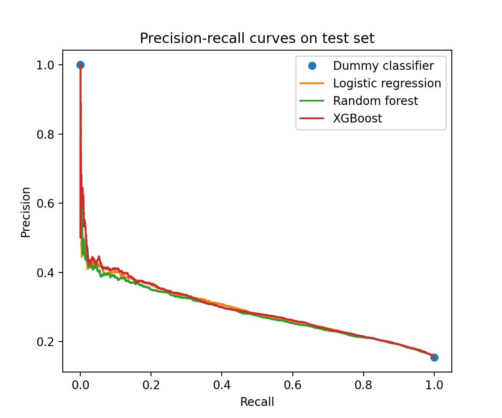

# LendingClub Loan Classification 

## Table of Contents

1. [Background](#background)
2. [Project Overview](#overview)
3. [Target and Predictors](#target)
4. [Data Processing](#processing)
5. [EDA Plots](#eda)
6. [Class Imbalance and Scoring](#class)
7. [Model Results](#results)
8. [Feature Importance](#objectives)
9. [Running the Code](#guide)
10. [Conclusions and Future Work](#future)

## Background 

[LendingClub](https://www.lendingclub.com/) is a fin-tech company started in 2006, whose focus is allowing consumers to access financial products using the internet. For most of its history, LendingClub's main product was facilitating unsecured peer-to-peer loans ranging from $1000 to $40,000. At its 2015 peak, LendingClub was the largest peer-to-peer loan platform in the world. At that point, $15.98 billion in loans had been originated through its history. In the fall of 2020, LendingClub ended its peer-to-peer lending program for undisclosed reasons to focus on commercial banking.

As of 2015, according to [Wikipedia](https://en.wikipedia.org/wiki/LendingClub#Loan_performance_statistics), the average LendingClub borrower had the following characteristics:

* FICO score of 699
* Debt-to-income ratio of 17.7%
* Credit history of 16.2 years
* Annual personal income of $73,945
* Sought out a loan of $14,553 for debt consolidation or paying off credit cards

On the investor side, LendingClub peer investors:

* Funded $11 billion in total loans, including $2 billion in Q2 2015
* Funded loans with an average nominal interest rate of 14% and default rate of 3.39% 
* Earned average net annualized returns of 8.93%.

## Project Overview 
### The Classification Task
While LendingClub boasted a default rate of 3.39%, a much higher percentage of its loans were categorized as "charged off." This means that the loan was unlikely to be fully paid, and therefore it had been sold to a third-party collections agency. As a potential investor seeking to maximize returns, it would be helpful to predict ahead of time whether a loan would be charged off or not. In this project, we built classification models using Logistic Regression, Random Forest, and XGBoost to predict charge-off status. 

### Dataset Description

The dataset we used contains over 2 million loans, with over 150 variables, spanning 2012 through 2018. A link to the dataset can be downloaded [here](https://www.kaggle.com/wordsforthewise/lending-club), and the official data dictionary for it can be downloaded [here](https://resources.lendingclub.com/LCDataDictionary.xlsx).

LendingClub periodically released its loan information on their website, but has since discontinued the practice. We used the most comprehensive LendingClub dataset we could find, which was scraped from the LendingClub website, agglomerated, and made available on [Kaggle](https://www.kaggle.com/wordsforthewise/lending-club). The dataset was described as loans from 2007 to 2018, but we only found loans from 2012 to 2018. Although LendingClub no longer provides formal support for its dataset online, we found a [data dictionary](https://resources.lendingclub.com/LCDataDictionary.xlsx) on their website that describes each of the variables.

### Purpose
The full dataset was only available for accepted loans, so we could only build models on loans that were accepted by LendingClub. We should clarify that this is a very different task than if we could build models on all loan applications. For the latter, it would be much easier to distinguish between good and bad loans, and such a classifier would be used as a primary filter, for example by LendingClub itself. What we have instead, is to build models classifying on the "good" loans that LendingClub deemed worthy of acceptance. This is a much harder task, so we expect performance to be much worse. A potential use would be, for example, as a secondary filter deployed by one of LendingClub's peer investors seeking any additional edge (over picking at random) to maximize their returns. 

## Target and Predictors 
### Selecting only loans from 2012 and 2013
Our target variable, `loan_status`, had three main values: `{Charged Off, Fully Paid, Current}`. We merged the much smaller proportions of late or defaulted loans with the Charged-Off category. Since we want to predict if a loan will be Charged Off or Fully Paid upon completion, we can't include loans whose status is Current. We couldn't select all the non-Current loans either, as that biases towards loans that get ended early. 

LendingClub loans had a term of 3 or 5 years, so we probably need to filter out all loans issued within 5 years of when the dataset was collected (2018). We created the following figure characterizing completed (or non-Current) loans by issuance year:

In the chart on the left, we see that completed loans issued from 2012 through 2015 increased dramatically, corresponding to LendingClub's general rise in popularity. 

On the right, we see that the percentage of completed loans which are Fully Paid remains stable for 2012 and 2013, for which all loans have naturally matured, but then steadily declines. This confirms our suspicion that prematurely ended loans (those from 2014 and onwards) are biased in a certain direction. 

Therefore, we had to filter out the vast majority of our dataset, and select only loans from 2012 and 2013.

### Dropping predictors to prevent data leakage

Many of the features we had available in our dataset were collected after loan issuance. Some of them were directly related to loan payments, or absence thereof. Others were redundant with having a charged-off loan, such as drops in credit score or decreases in borrowing limits. There was a lot of potential for data leakage, so we went through the data dictionary and dropped all predictors which were possibly collected after loan issuance.

The remaining preddictors, we are confident would be availble to us in a real-world setting. Useful ones include FICO score, grade (given by LendingClub), interest rate (assigned by LendingClub), annual income, employee length, state, debt-to-income ratio, and others. We briefly considered whether grade and interest rate, since they are reflective of charge-off probability, might be considered data leakage, but as we stated above the purpose is to build a classifier on top of information provided by LendingClub, which could be used by an individual investor.

## Data Processing 

Our 

> Challenge 1: Too large to load

-Leveraged dask to load the full dataset and then drop columns.

-Performed memory management with dtypes to optimize pandas speed.

-Challenge 2: Categorical & ordinal data

-Converted ordinal values to numeric. For example, grade and length of employment.

Some categorical variables needed 50+ dummies (like state).

Challenge 3: Missing values

-Filtered out columns with greater than 10% missing values.

-Dropped rows with any missing values (checked to see this didn’t alter target variable much).

### Final Dataset
Shape: (152,069, 104)

152,069 loans from 2012 to 2013:
    15.4% charged-off (label 1)
    84.6% fully paid (label 0)

~40 predictor variables, with dummy categories bringing columns to 104

## EDA Plots 

## Objectives 
Potential targets:

**Predict charge-off rates                  (classification task)**

Predict whether loan was profitable     (classification task)

Predict return (%) from loan             (regression task)

Candidate models (for classification):

-Logistic regression

-Random forest

-XGBoost (gradient boosted trees)

## Class Imbalance and Scoring 
15% vs 85% imbalance

However:
There are much worse cases out there (1% vs 99%)
There is a sufficient number of the minority class (tens of thousands)
The class imbalance also exists in the population

We could: undersample majority class, make synthetic data from minority class (SMOTE), use “class_weight = balanced” in model loss functions

Models will want to predict everything is in the 85% group (Fully Paid). This simply depends on the threshold used.

### Scoring metric
If we use threshold-agnostic metrics to evaluate our models, class imbalance shouldn’t be a problem. E.g. ROC AUC, brier score

Accuracy, recall, and precision all depend on the threshold used.

ROC AUC is threshold-agnostic and gives more nuanced information about the model. Since the data is imbalanced, better to use Precision-Recall AUC.

Brier loss is also threshold-agnostic. It uses the direct probabilities given by the model. It’s the mean squared error between target outcome and predicted probability.

Brier loss ranges from 0 (good) to 1 (bad). 

A random 50/50 model would have a Brier loss of 0.25.

## Model Results 

|  | Configuration | Train Scores | Test Scores
| --- | ---| --- | ---|
| Dummy classifier (majority) | Gives perfect probability of   being majority class | n/a | PR AUC: 0.577   Brier loss: 0.154   ROC AUC: 0.5  
| Logistic Regression | Standardized data   Default regularization   Max_iter = 1000 | PR AUC: 0.290   Brier loss: 0.121   ROC AUC: 0.7 | PR AUC: 0.291   Brier loss: 0.121   ROC AUC: 0.7
| Random Forest | max_depth = 6   n_estimators = 20 | PR AUC: 0.294   Brier loss: 0.123   ROC AUC: 0.698 | PR AUC: 0.279   Brier loss: 0.123   ROC AUC: 0.689
| XGBoost | max_depth = 5   n_estimators = 10   eta (learning rate) = 0.1 | PR AUC: 0.289   Brier loss: 0.138   ROC AUC: 0.696 | PR AUC: 0.28   Brier loss: 0.138   ROC AUC: 0.689

## Conclusions and Future Work 

Surprisingly poor performance despite strong variables (grade, FICO score, interest rate).

Just as an example, to get a recall of 0.8, we would have precision of only 0.2.

All models (logistic, random forest, xgboost) performed similarly.

Possibly because we are training on loans that were already accepted by LendingClub, so hard to discriminate them further based on variables that LendingClub already used.

Future work could be to train on other targets, like profitability. Also quantify how much better our model does than random in terms of profitability for an investor.
## References

1. https://www.kaggle.com/wordsforthewise/lending-club
2. https://en.wikipedia.org/wiki/LendingClub
3. https://resources.lendingclub.com/LCDataDictionary.xlsx